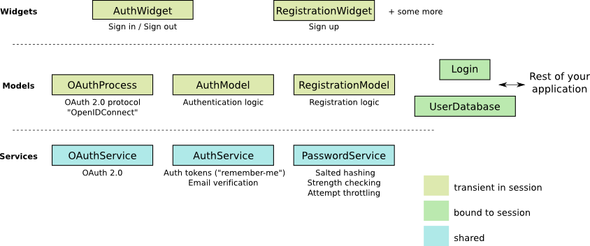

= Introduction to Wt::Auth

For Wt 4.10.0

:doc: link:../reference/html/
:tutorials: link:./
:wt-src: link:https://github.com/emweb/wt/tree/master/
:cpp: pass:[C++]

== Prerequisites

In this tutorial, we use an example as a hands-on introduction to the Wt authentication
module. This example is included in the Wt distribution, in
{wt-src}examples/feature/auth1[`+examples/feature/auth1+`].

This introduction assumes that you have a reasonable understanding of
Wt itself, in particular its stateful session model and the widget
concept. If you haven't done so yet, you may want to go through the
{tutorials}wt.html[Wt tutorial] first.

== Introduction

The authentication module implements the logic and widgets involved in
getting users registered on your application, and letting them sign
in. Note that this module is entirely optional, and simply implemented
on top of link:https://www.webtoolkit.eu/wt[Wt].

The module implements
link:https://en.wikipedia.org/wiki/Authentication[authentication]. Its main
purpose is to securely authenticate a user to sign in to your
application. From your application, you will interact with the
authentication module using a
{doc}classWt_1_1Auth_1_1Login.html[`+Wt::Auth::Login+`] object, which you
typically hold in your application object. It indicates the user
currently signed in (if any), and propagates authentication events.

How you use this information for
link:https://en.wikipedia.org/wiki/Authorization[authorization] or to
customize the user experience is out of the scope of the
module. Because of Wt's built-in security features, with strong
session hijacking mitigation, this is as straightforward as one can
conceive it.

Currently, the module provides the following features, which can be
separately enabled, configured or customized:

* *Password authentication*, using
link:https://stackoverflow.com/questions/549/the-definitive-guide-to-forms-based-website-authentication[best practices]
including link:https://en.wikipedia.org/wiki/Salted_hash[salted hashing]
with strong cryptographic hash functions (such as link:https://en.wikipedia.org/wiki/Bcrypt[bcrypt])
and password strength checking.

* *Remember me* functionality, again using best practices, by
associating authentication tokens stored in cookies to a user.

* *Verified email addresses* using the typical confirmation email
process.

* *Lost password functionality* that uses the verified email address
to prompt a user to enter a new password.

* Authentication using *3rd party Identity Providers*, using
OAuth 2.0 (including standard implementations for Facebook, Google, and
generic OpenID Connect) and SAML.

* *Registration* logic, which includes also the logic needed to merge
new (federated login) identities into existing user profiles. For
example, if a user previously registered using a username and
password, they may later also authenticate using for example their Google
Account and this new identity is added to his existing account.

The logic for these features is implemented separately from the
user interface components, which can be customized or completely
replaced with your own widgets.

Obviously, the authentication logic needs to talk to a storage system,
and it is designed to hook into a storage system using an abstract
interface. A default implementation that leverages
http://www.webtoolkit.eu/wt/doc/tutorial/dbo/tutorial.html[Wt::Dbo],
Wt's ORM, is provided.

== Module organization

The following picture illustrates the main classes of the module.

It uses a classical separation between Model classes and View classes
(which are the widgets).

There are three types of model classes:

* *Service classes* are designed to be shared across all sessions
(they do not have any state besides configuration). They contain logic
which does not require transient state in a session.

* *Session-bound* model classes are usually kept in a session for the
entire lifetime of a session (but don't need to be).

* *Transient* model classes play an active role in the user interface,
and are instantiated in the context of certain view components. They
implement logic which involves state while the user is progressing
through the login and registration process.

== Example

We'll walk through a small example which is a basic application that
uses the authentication module (included in the Wt distribution in
{wt-src}examples/feature/auth1[examples/feature/auth1]). It
is about 200 lines of C++ (which we'll discuss below), and has the
following features:

* Password-based authentication and registration
* OAuth 2 login and registration, for Google and Facebook accounts
* Password attempt throttling
* Email verification and a lost password procedure
* Remember-me tokens
* And by virtue of Wt itself, falls back to plain HTML behavior if the
browser does not support Ajax, strong security, spam resilience, etc.

This example should help you to understand how to add authentication
support to a new or existing Wt project.

=== Setting up a user database

We will be using the default implementation for an authentication
database using `+Wt::Dbo+`, with the default persistence classes for
authentication. This database implementation is found in
{doc}classWt_1_1Auth_1_1Dbo_1_1UserDatabase.html[`+Wt::Auth::Dbo::UserDatabase+`],
and it uses
{doc}classWt_1_1Auth_1_1Dbo_1_1AuthInfo.html[`+Wt::Auth::Dbo::AuthInfo+`]
as the persistence class for authentication information, which itself
references two other persistence classes:

* A user's *"identities"* are stored in a separate table. An identity
uniquely identifies a user. Traditionally, a user would have only a
single identity which is their login name (which could be their email
address). But a user may accumulate more identities, corresponding to
accounts with 3rd party identity providers. By allowing multiple
identities, the user may identify using a choice of methods.
* *Authentication tokens* are stored in a separate table. An
authentication token usually corresponds to a "remember-me" cookie,
and a user may have multiple "remember-me" cookies when using
different computers.

In addition, we define a `+User+` type to which we can add the
application data for a particular user (this could be address
information, birthdate, preferences, user role, etc...), and which we
want to link up with the authentication system.

The definition and persistence mapping for (a currently empty) `+User+`
type is as given below:

.User.h
[source,cpp]
----
#include <Wt/Dbo/Types.h>
#include <Wt/WGlobal.h>

class User;
using AuthInfo = Wt::Auth::Dbo::AuthInfo<User>;

class User {
public:
  template<class Action>
  void persist(Action& a)
  {
  }
};

DBO_EXTERN_TEMPLATES(User)
----

We declare a type alias for `+AuthInfo+`, which links the authentication
information persistence class to our custom `+User+` information
persistence class.

Next, we define a session class, which encapsulates the connection to
the database to store authentication information, and which also
tracks the user currently logged in, in a web session. We choose to
use the
{doc}classWt_1_1Dbo_1_1Session.html[`+Wt::Dbo::Session+`]
class as a base class (which could just as well be an embedded
member).

Later on, we'll see how each web session will instantiate its own
persistence/authentication `+Session+` object.

.Session.h
[source,cpp]
----
#include <Wt/Auth/Login.h>
#include <Wt/Auth/UserDatabase.h>

#include <Wt/Dbo/Session.h>
#include <Wt/Dbo/ptr.h>

#include "User.h"

namespace dbo = Wt::Dbo;

using UserDatabase = Wt::Auth::Dbo::UserDatabase<AuthInfo>;

class Session : public dbo::Session
{
public:
  explicit Session(const std::string& sqliteDb);

  Wt::Auth::AbstractUserDatabase& users();
  Wt::Auth::Login& login() { return login_; }

  ...

private:
  std::unique_ptr<UserDatabase> users_;
  Wt::Auth::Login login_;

  ...
};
----

Notice the type alias for `+UserDatabase+`, which states that we will be
using the
{doc}classWt_1_1Auth_1_1Dbo_1_1UserDatabase.html[`+Wt::Auth::Dbo::UserDatabase+`]
implementation using `+AuthInfo+`, for which we declared a type alias
earlier on. You are of course free to provide another implementation
for
{doc}classWt_1_1Auth_1_1AbstractUserDatabase.html[`+Wt::Auth::AbstractUserDatabase+`]
which is not based on `+Wt::Dbo+`.

We also embed a
{doc}classWt_1_1Auth_1_1Login.html[`+Wt::Auth::Login+`]
member here, which is a small model class that holds the current login
information. The login/logout widgets will manipulate this login
object, while the rest of our application will listen to login changes
from this object to adapt to the user currently logged in.

The `+Session+` constructor sets up the database session.

.Session.C (constructor)
[source,cpp]
----
#include "Session.h"
#include "User.h"

#include <Wt/Auth/Dbo/AuthInfo.h>

#include <Wt/Dbo/backend/Sqlite3.h>

using namespace Wt;

Session::Session(const std::string& sqliteDb)
{
  auto connection = std::make_unique<Dbo::backend::Sqlite3>(sqliteDb);
  setConnection(std::move(connection_));

  mapClass<User>("user");
  mapClass<AuthInfo>("auth_info");
  mapClass<AuthInfo::AuthIdentityType>("auth_identity");
  mapClass<AuthInfo::AuthTokenType>("auth_token");

  try {
    createTables();
    std::cerr << "Created database.\n";
  } catch (Wt::Dbo::Exception& e) {
    std::cerr << e.what() << '\n';
    std::cerr << "Using existing database\n";
  }

  users_ = std::make_unique<UserDatabase>(*this);
}
----

The example uses an SQLite3 database, a cuddly database convenient for
development, and we map four persistence classes to tables.

We then create the data schema if needed, which will automatically
issue the following SQL:

[source,sql]
----
create table "user" (
  "id" integer primary key autoincrement,
  "version" integer not null
);

create table "auth_info" (
  "id" integer primary key autoincrement,
  "version" integer not null,
  "user_id" bigint,
  "password_hash" varchar(100) not null,
  "password_method" varchar(20) not null,
  "password_salt" varchar(20) not null,
  "status" integer not null,
  "failed_login_attempts" integer not null,
  "last_login_attempt" text,
  "email" varchar(256) not null,
  "unverified_email" varchar(256) not null,
  "email_token" varchar(64) not null,
  "email_token_expires" text,
  "email_token_role" integer not null,
  constraint "fk_auth_info_user"
    foreign key ("user_id") references "user" ("id")
    on delete cascade deferrable initially deferred
);

create table "auth_token" (
  "id" integer primary key autoincrement,
  "version" integer not null,
  "auth_info_id" bigint,
  "value" varchar(64) not null,
  "expires" text,
  constraint "fk_auth_token_auth_info"
    foreign key ("auth_info_id") references "auth_info" ("id")
    on delete cascade deferrable initially deferred
);

create table "auth_identity" (
  "id" integer primary key autoincrement,
  "version" integer not null,
  "auth_info_id" bigint,
  "provider" varchar(64) not null,
  "identity" varchar(512) not null,
  constraint "fk_auth_identity_auth_info"
    foreign key ("auth_info_id") references "auth_info" ("id")
    on delete cascade deferrable initially deferred
);
----

Notice the `+auth_info+`, `+auth_token+` and `+auth_identity+` tables that
define the storage for our authentication system.

=== Configuring authentication

The service classes
({doc}classWt_1_1Auth_1_1AuthService.html[`+Wt::Auth::AuthService+`],
{doc}classWt_1_1Auth_1_1PasswordService.html[`+Wt::Auth::PasswordService+`],
and
{doc}classWt_1_1Auth_1_1OAuthService.html[`+Wt::Auth::OAuthService+`]),
can be shared between sessions and contain the configuration and logic
which does not require transient session state.

A good location to add these service classes are inside a specialized
{doc}classWt_1_1WServer.html[`+Wt::WServer+`]
instance, of which you usually also have only one in a Wt process. You
could also create a singleton for them. To keep the example simple, we
will declare them simply as global variables (but within file scope):
`+myAuthService+`, `+myPasswordService+`, and `+myOAuthServices+`.

.Session.C (authentication services)
[source,cpp]
----

#include <Wt/Auth/AuthService.h>
#include <Wt/Auth/HashFunction.h>
#include <Wt/Auth/PasswordService.h>
#include <Wt/Auth/PasswordStrengthValidator.h>
#include <Wt/Auth/PasswordVerifier.h>
#include <Wt/Auth/GoogleService.h>
#include <Wt/Auth/FacebookService.h>

namespace {
  Wt::Auth::AuthService myAuthService;
  Wt::Auth::PasswordService myPasswordService(myAuthService);
  std::vector<std::unique_ptr<Wt::Auth::OAuthService>> myOAuthServices;
}

void Session::configureAuth()
{
  myAuthService.setAuthTokensEnabled(true, "logincookie");
  myAuthService.setEmailVerificationEnabled(true);
  myAuthService.setEmailVerificationRequired(true);

  auto verifier = std::make_unique<Wt::Auth::PasswordVerifier>();
  verifier->addHashFunction(std::make_unique<Wt::Auth::BCryptHashFunction>(7));
  myPasswordService.setVerifier(std::move(verifier));
  myPasswordService.setAttemptThrottlingEnabled(true);
  myPasswordService.setStrengthValidator(
    std::make_unique<Wt::Auth::PasswordStrengthValidator>());

  if (Wt::Auth::GoogleService::configured()) {
    myOAuthServices.push_back(std::make_unique<Wt::Auth::GoogleService>(myAuthService));
  }

  if (Wt::Auth::FacebookService::configured()) {
    myOAuthServices.push_back(std::make_unique<Wt::Auth::FacebookService>(myAuthService));
  }

  for (const auto& oAuthService : myOAuthServices) {
    oAuthService->generateRedirectEndpoint();
  }
}

Wt::Auth::AbstractUserDatabase& Session::users()
{
  return *users_;
}

const Wt::Auth::AuthService& Session::auth()
{
  return myAuthService;
}

const Wt::Auth::PasswordService& Session::passwordAuth()
{
  return myPasswordService;
}

std::vector<const Wt::Auth::OAuthService *> Session::oAuth()
{
  std::vector<const Auth::OAuthService *> result;
  result.reserve(myOAuthServices.size());
  for (const auto& auth : myOAuthServices) {
    result.push_back(auth.get());
  }
  return result;
}
----

The {doc}classWt_1_1Auth_1_1AuthService.html[`+AuthService+`]
is configured to support "remember-me" functionality, and email
verification.

The
{doc}classWt_1_1Auth_1_1PasswordService.html[`+PasswordService+`]
needs a hash function to safely store passwords. You can actually
define more than one hash function, which is useful only if you want
to migrate to a new hash function while still supporting existing
passwords. When a user logs in, and they are not using the "preferred"
hash function, their password will be rehashed with the preferred
one. In this example, we will use
link:https://en.wikipedia.org/wiki/Bcrypt[bcrypt], which is included as a
{doc}classWt_1_1Auth_1_1HashFunction.html[hash
function] in Wt::Auth.

We also enable password attempt throttling: this mitigates brute force
password guessing attempts.

Finally, we also use two (but later, perhaps more)
{doc}classWt_1_1Auth_1_1OAuthService.html[`+OAuthService+`]
classes. You need one service per identity provider. In this case,
we add Google and Facebook as identity providers.

=== The user interface

We create a specialized
{doc}classWt_1_1WApplication.html[`+WApplication+`]
which contains our authentication session, and instantiates an
{doc}classWt_1_1Auth_1_1AuthWidget.html[`+AuthWidget+`]. This
widget shows a login or logout form (depending on the login status),
and also hooks into default forms for registration, lost passwords,
and handling of email-sent tokens in URLs).

.User interface
[source,cpp]
----
#include <Wt/WApplication.h>
#include <Wt/WBootstrap2Theme.h>
#include <Wt/WContainerWidget.h>
#include <Wt/WServer.h>

#include <Wt/Auth/AuthWidget.h>
#include <Wt/Auth/PasswordService.h>

#include "model/Session.h"

class AuthApplication : public Wt::WApplication {
public:
  explicit AuthApplication(const Wt::WEnvironment& env)
    : Wt::WApplication(env),
      session_(appRoot() + "auth.db")
  {
    session_.login().changed().connect(this, &AuthApplication::authEvent);

    root()->addStyleClass("container");
    setTheme(std::make_shared<Wt::WBootstrap2Theme>());

    useStyleSheet("css/style.css");

    auto authWidget = std::make_unique<Wt::Auth::AuthWidget>(
            Session::auth(), session_.users(), session_.login());

    authWidget->model()->addPasswordAuth(&Session::passwordAuth());
    authWidget->model()->addOAuth(Session::oAuth());
    authWidget->setRegistrationEnabled(true);

    authWidget->processEnvironment();

    root()->addWidget(std::move(authWidget));
  }

  void authEvent() {
    if (session_.login().loggedIn()) {
      const Wt::Auth::User& u = session_.login().user();
      log("notice")
        << "User " << u.id()
        << " (" << u.identity(Wt::Auth::Identity::LoginName) << ")"
        << " logged in.";
    } else
      log("notice") << "User logged out.";
  }

private:
  Session session_;
};
----

The last part is our main function where we setup the application server:

.Application server setup
[source,cpp]
----
std::unique_ptr<Wt::WApplication> createApplication(const Wt::WEnvironment &env)
{
  return std::make_unique<AuthApplication>(env);
}

int main(int argc, char **argv)
{
  try {
    Wt::WServer server{argc, argv, WTHTTP_CONFIGURATION};

    server.addEntryPoint(Wt::EntryPointType::Application, createApplication);

    Session::configureAuth();

    server.run();
  } catch (Wt::WServer::Exception& e) {
    std::cerr << e.what() << '\n';
  } catch (Wt::Dbo::Exception &e) {
    std::cerr << "Dbo exception: " << e.what() << '\n';
  } catch (std::exception &e) {
    std::cerr << "exception: " << e.what() << '\n';
  }
}
----

